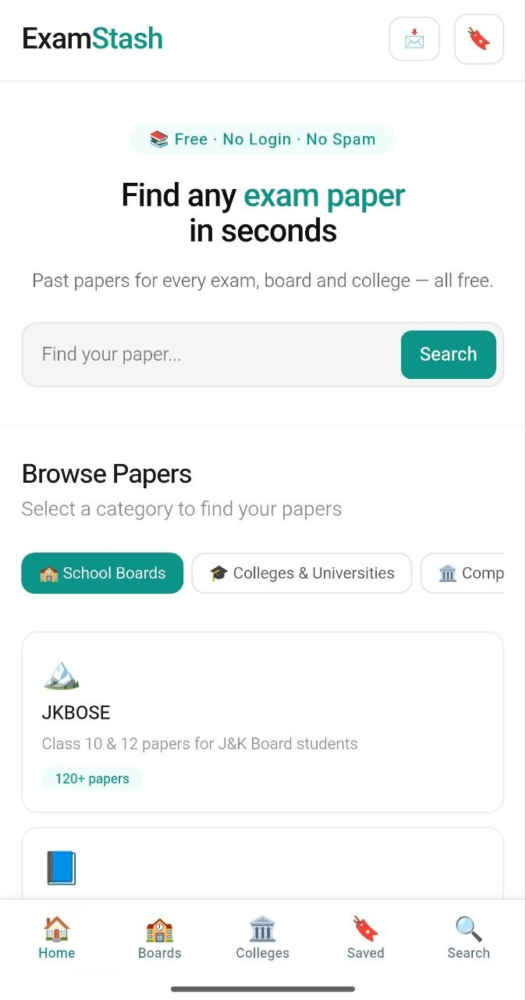

# Examstash

Previous-year question papers and study resources, organized for students.

**Live site → [https://examstash.pages.dev/](https://examstash.pages.dev/)**

---

## Why I Built It

I built Examstash with a simple idea: finding previous-year papers shouldn't be harder than studying for the exam itself.

During exam time, students often spend hours jumping between random websites, broken links, spam redirects, and cluttered WhatsApp groups just to track down a single past question paper. Most websites in this space are overloaded with popups or force you to sign up for an account before letting you view anything.

Examstash puts that material into one clean, fast, and organized place where any student can find what they need in seconds — completely free, with no accounts or download walls.

---

## What It Offers

* **Previous-Year Question Papers:** Direct access to past annual and bi-annual board papers and university semester exams.
* **Official Syllabi:** Curriculum outlines and course structures alongside question papers.
* **In-Browser PDF Previews:** View question papers directly on the page using a lightweight preview modal before downloading.
* **Instant Search:** In-memory autocomplete search across all boards, classes, courses, and subjects (with `Ctrl + K` and `/` keyboard shortcuts).
* **Saved Papers (Offline Bookmarks):** Bookmark frequently used papers to your browser storage and access them anytime through a slide-over drawer.
* **Classroom Sharing:** 1-tap WhatsApp and Telegram share buttons with pre-formatted messages to easily send papers to class study groups.
* **"Request a Paper" Option:** An interactive form that lets students request missing papers directly via Telegram or Email.
* **Progressive Web App (PWA):** Installable on Android and iOS with offline shell caching (`sw.js`) and a sticky mobile navigation bar.
* **Responsive Design:** Optimized for mobile phones, tablets, laptops, and desktop screens.
* **No Mandatory Logins:** Every document is immediately accessible.

---

## Academic Organization

The repository and website follow a straightforward academic structure:

```text
School Boards (JKBOSE, CBSE, ICSE)
└── Classes (Class 10, Class 12)
    └── Streams & Subjects (Science, Commerce, Arts, Vocational)
        └── Years & Series (e.g. 2026 Series A, B, C / 2023)
            └── PDF Download & Online Preview

Colleges & Universities (Islamia College, Kashmir University)
└── Degree Programs (BCA, BBA, B.Com, B.A, B.Sc IT, MBA)
    └── Semesters (Semester 1 to 6)
        └── Subjects & Syllabus
```

---

## Paper Availability Rule

Examstash follows a strict data availability principle:

1. **A paper page only exists if a genuine document link is available.**
2. **Missing years or subjects show a clear "Coming Soon" status** instead of dead links or empty placeholder pages.
3. **No fake download buttons or ad redirects.**

This ensures students never waste time clicking on empty pages.

---

## Current Coverage

### School Boards
* **JKBOSE:**
  * **Class 10:** Mathematics (2023, 2026 Series A/B/C), Science (2026 Series A/B), English (2026 Series C), Social Science (2026 Series A), Hindi, Urdu.
  * **Class 12:** Science stream (Physics, Chemistry, Biology, Mathematics, Computer Science, Biotechnology, etc.), Commerce stream (Accountancy, Business Studies, Economics, etc.), Arts stream (History, Political Science, Economics, Sociology, etc.), Home Science, Vocational streams, and Open School.
* **CBSE:** Class 10 & Class 12 directories.
* **ICSE:** Class 10 & Class 12 directories.

### Colleges & Universities
* **Islamia College of Science & Commerce (ICSC):**
  * BCA (Semesters 1 through 6)
  * BBA (Semesters 1 through 6)
  * B.Com (Semesters 1 through 6)
  * B.A (Semesters 1 through 6)
  * B.Sc IT (Semesters 1 through 6)
  * MBA (Semesters 1 through 4)
* **University Portals:** Kashmir University, Cluster University, BGSBU.
* **Competitive Exams:** NEET, JEE Main, CUET, JKPSC.

---

## Screenshots

### Homepage


### JKBOSE Board & Streams


### Islamia College Portal


### Mobile View
<p align="center">
  
</p>

---

## Tech Stack

Examstash is intentionally built with vanilla web technologies to keep page load times near-instantaneous on slow mobile networks:

* **Frontend:** HTML5, Modern CSS3 (CSS Grid, Flexbox, custom properties), ES6+ JavaScript.
* **Offline & PWA:** Service Worker (`sw.js`), Web App Manifest (`manifest.json`), LocalStorage API.
* **Static Generation & CLI:** Python 3 (`generate.py`, `generate_sitemap.py`, `validate_site.py`, `add_paper.py`).
* **Document Hosting:** Google Drive Cloud Storage (stream embeds and direct download endpoints).
* **Hosting & CDN:** Cloudflare Pages with custom edge cache headers (`_headers`).
* **CI/CD:** GitHub Actions workflow running automated link health checks and sitemap verification on every push.

---

## Project Structure

```text
Examstash/
├── index.html              # Homepage with search, board tabs & PWA prompt
├── manifest.json           # PWA Web App Manifest
├── sw.js                   # Service Worker (offline shell caching)
├── robots.txt              # Search engine crawler instructions
├── sitemap.xml             # XML sitemap for search engines
├── _headers                # Cloudflare Pages 1-year immutable edge caching rules
│
├── assets/
│   ├── css/
│   │   └── global.css      # Design system, modal overlays, bookmarks, PWA styling
│   ├── js/
│   │   ├── search.js       # Autocomplete search & keyboard shortcuts (Ctrl+K, /)
│   │   ├── search-index.js # Client-side search index database
│   │   ├── bookmarks.js    # Saved papers drawer & LocalStorage controller
│   │   ├── pwa.js          # Service Worker registration & mobile navigation bar
│   │   ├── request-paper.js# Interactive paper request modal
│   │   └── analytics.js    # Privacy-friendly event tracking
│   ├── icons/              # Vector PWA icons
│   └── images/             # OpenGraph social sharing preview cards
│
├── jkbose/                 # JKBOSE board paper hierarchies
├── cbse/                   # CBSE board paper hierarchies
├── icse/                   # ICSE board paper hierarchies
├── islamia-college/        # Islamia College course & semester pages
├── kashmir-university/     # Kashmir University section
│
├── add_paper.py            # CLI tool to ingest new question papers in seconds
├── generate.py             # Paper page compiler & recommendation engine
├── generate_sitemap.py     # XML sitemap generator
└── validate_site.py        # Automated link & asset integrity checker
```

---

## Local Setup

No heavy build tools, Node modules, or package managers are needed. You only need Python 3 installed.

### 1. Clone the repository
```bash
git clone https://github.com/sahilsleem/Examstash.git
cd Examstash
```

### 2. Run a local server
```bash
python -m http.server 8000
```
Open **[http://localhost:8000](http://localhost:8000)** in your browser.

---

## Adding Papers (Workflow)

To add a new question paper to the platform:

```text
1. Upload PDF to Google Drive & set to "Anyone with link"
   ↓
2. Run python add_paper.py (interactive CLI)
   ↓
3. Script compiles HTML page + updates search index + updates sitemap
   ↓
4. Run python validate_site.py to verify all links
   ↓
5. Commit and push to main (Cloudflare Pages auto-deploys in ~30s)
```

### Example CLI usage:
```bash
python add_paper.py --board jkbose --class class-10 --subject maths --year 2026 --series a --drive-id <GOOGLE_DRIVE_FILE_ID>
```

---

## Validation & Site Health

Examstash includes an automated site validator that scans every internal link, anchor, image, and script reference:

```bash
python validate_site.py
```

Output:
```text
============================================================
 ExamStash Site Health & Integrity Validator
============================================================
Found 151 HTML pages to scan.
Sitemap check: 151 URLs registered in sitemap.xml.
------------------------------------------------------------
Checked 1117 internal links
Checked 1359 static asset references
------------------------------------------------------------
PASSED: 0 broken links, 0 missing assets!
```

---

## Responsive Design

The interface is built from the ground up to be responsive and comfortable across all device sizes:

* **Phones:** Sticky bottom navigation bar, single-column paper cards, full-width touch targets.
* **Tablets:** Responsive multi-column grids for subject lists and search suggestions.
* **Laptops & Desktops:** Expanded layouts with quick keyboard shortcuts (`Ctrl + K`, `/`) and side drawers.

---

## What's Next

- [ ] Add more past-year series for JKBOSE Class 10 & Class 12.
- [ ] Expand semester-wise papers for Islamia College (BCA, BBA, B.Com, B.Sc IT).
- [ ] Add previous year papers for Kashmir University and Cluster University courses.
- [ ] Keep validating all document links to maintain zero dead links.

---

## Contributing & Submitting Papers

Have past examination papers or syllabi from your school, college, or university?

You can submit them directly:
* **Telegram:** [@sahilsleem](https://t.me/sahilsleem)
* **Email:** [examstash1@gmail.com](mailto:examstash1@gmail.com)

If you'd like to contribute code or fix typos, feel free to fork the repo, make your change, and open a Pull Request.

---

## Contact

* **Instagram:** [@sahilsleem](https://www.instagram.com/sahilsleem/)
* **Telegram:** [@sahilsleem](https://t.me/sahilsleem)
* **Email:** [examstash1@gmail.com](mailto:examstash1@gmail.com)

---

## License

This project is open-source under the [MIT License](LICENSE).

---

Built for students.
