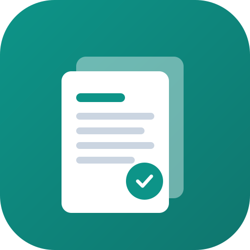

# 📚 ExamStash — Free Question Papers & Syllabus

<p align="center">
  
</p>

<p align="center">
  <strong>Fast, free, and distraction-free previous year exam question papers and syllabus for Indian students.</strong>
</p>

<p align="center">
  <a href="https://examstash.pages.dev/"></a>
  <a href="https://github.com/sahilsleem/Examstash/releases/tag/v1.0.0"></a>
  <a href="LICENSE"></a>
  
</p>

---

## 🌟 Overview

**ExamStash** is a lightweight, blazing-fast static educational web platform built for school and college students across India. It provides instant access to previous years' board exam question papers, university semester papers, and competitive entrance exam materials — **100% free, with no mandatory login, pop-up walls, or spam**.

🔗 **Live Website:** [https://examstash.pages.dev/](https://examstash.pages.dev/)

---

## 🚀 Key Features

| Feature | Description |
| :--- | :--- |
| 🔍 **Real-Time Autocomplete Search** | Instant in-memory search with keyword matching, arrow-key navigation, and `Ctrl + K` / `/` shortcut. |
| 👁️ **In-Browser PDF Previews** | View Google Drive question papers directly in a clean popup modal without forcing downloads. |
| 🔖 **Offline Saved Papers Drawer** | Save papers to browser `localStorage` and access them anytime via the slide-over saved drawer. |
| 📱 **Progressive Web App (PWA)** | Installable to Android & iOS home screens with offline caching (`sw.js` v3) and mobile bottom navigation. |
| 📲 **1-Tap Classmate Sharing** | Share question papers directly to WhatsApp study groups and Telegram channels with pre-filled messages. |
| 📩 **Interactive Paper Requests** | 1-click paper request modal that formats submissions directly for Telegram (`@sahilsleem`) and Email. |
| 🚀 **Google Rich Results (JSON-LD)** | Schema.org `LearningResource`, `BreadcrumbList`, and `WebSite` Sitelinks search box structured data. |
| ⚡ **Cloudflare Pages CDN** | Ultra-fast global static delivery with 1-year immutable edge caching (`_headers`). |

---

## 🏫 Boards & Universities Covered

- **School Boards:** JKBOSE (Class 10 & 12), CBSE (Class 10 & 12), ICSE (Class 10 & 12), Open School
- **Colleges & Universities:** Islamia College of Science & Commerce (BCA, BBA, B.Com, B.A, B.Sc IT, MBA), Kashmir University, Cluster University, BGSBU
- **Competitive Entrance Exams:** NEET, JEE Main, CUET, JKPSC

---

## 🛠️ Tech Stack & Architecture

- **Frontend:** Vanilla HTML5, CSS3, ES6+ JavaScript (Zero heavyweight framework dependencies, ultra-fast initial paint).
- **Backend / Static Generator:** Python 3 (`generate.py`, `generate_sitemap.py`).
- **Storage:** Google Drive Cloud Storage (Direct stream embeds & direct PDF downloads).
- **Hosting & Edge Delivery:** Cloudflare Pages & GitHub Pages CI/CD.

---

## 💻 Developer & Admin Commands

### 1. Ingest a New Question Paper in Seconds
Run the interactive CLI ingestion assistant:
```powershell
python add_paper.py
```
Or pass arguments directly:
```powershell
python add_paper.py --board jkbose --class class-10 --subject maths --year 2026 --series a --drive-id 1vC3Xq8AbCdEf...
```
*(Automatically compiles the page, updates the search index, and refreshes the sitemap).*

### 2. Verify Site Health & Broken Links
Crawl all 151 pages, 1,117 links, and asset paths:
```powershell
python validate_site.py
```

### 3. Recompile All Pages & Sitemap
```powershell
python generate.py
python generate_sitemap.py
```

### 4. Run Local Preview Server
```powershell
python -m http.server 8000
```
Open [http://localhost:8000/](http://localhost:8000/) in your browser.

---

## 🤝 Contributing

Contributions of past examination papers and syllabi are warmly welcome!
- Open an issue or submit a Pull Request.
- Or send question paper PDFs/photos to **`examstash1@gmail.com`** or on Telegram **[@sahilsleem](https://t.me/sahilsleem)**.

---

## 📜 License

This project is open-source and available under the [MIT License](LICENSE).

<p align="center">
  Built with ❤️ for students across India.
</p>
